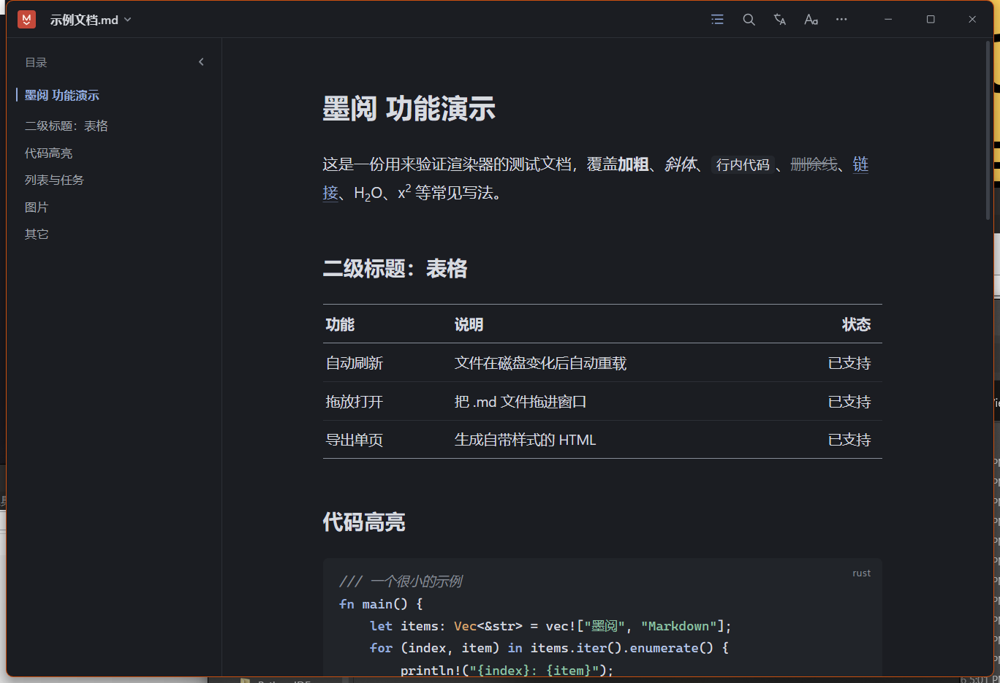
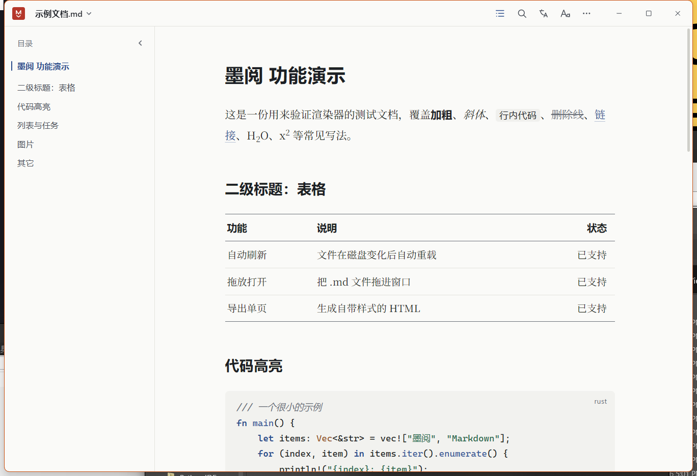

# 墨阅 · Markdown 阅读器

单文件、免安装的 Windows Markdown 阅读器。一个 `MoyueMD.exe`（约 1.6 MB）双击就能用，不需要 .NET、VC++ 运行库、Python 或 Node——只需要系统自带的 WebView2。

界面是自绘的：连标题栏都是自己的。整个窗口是一张纸，用留白和 1px 细线分区，颜色取国画颜料（墨写字、花青管交互、朱砂只给印章、藤黄只做标记），标题黑体、正文可选黑体或宋体、引文楷体。




## 它能做什么

**读**

- GitHub 风格渲染：表格、任务列表、脚注、定义列表、删除线、上下标（`H~2~O` → H₂O、`x^2^` → x²）
- 代码块自动折行 + 语言标签 + 语法高亮；没标语言的块保持纯文本，不会被乱上色
- 相对路径引用的本地图片自动内联
- 编码自动识别：UTF-8 / UTF-8 BOM / UTF-16 / GBK 回退
- 三线表；宽表不会撑破版面，单元格里的长路径会断在斜杠处

**用**

- **书眉**：顶部显示文件名和正在读的那一节，滚到新的一节会跟着换；点文件名看路径、编码、字数、阅读时间、最近打开
- 目录栏按层级缩进，当前章节高亮；`Ctrl+F` 查找（浮框，无结果时计数变红）
- 深色 / 浅色、黑体 / 宋体、字号都可调，设置会记住
- 文件在磁盘上被改动后自动重新读取
- 导出成自带样式的单页 HTML（`Ctrl+S`），打印或存 PDF（`Ctrl+P`）
- 代码块右上角悬停出现「复制」
- 可以注册成 `.md` 的默认打开程序（程序内一键完成，不需要管理员权限）

**译**

右侧面板可把全文或选中段落翻成 10 种语言。整篇翻译直接读源文件，**标题、列表、表格、行内格式全部保留**，译文仍按 Markdown 渲染。

代码块里的**注释也能翻译**（可开关）：`//`、`#`、`--`、`/* */`、`<!-- -->`、Python 文档字符串等都认得，代码本身一个字不动；字符串里的 `//`、URL 里的 `#` 不会误判。

## 下载 / 构建

没有预编译包的话，自己构建：装好 [Rust 工具链](https://rustup.rs/)（MSVC 目标）后

```bash
cargo build --release
# 产物：target/release/MoyueMD.exe
```

构建脚本会用 Windows SDK 的 `rc.exe` 把多尺寸图标和中文版本信息编进 exe；SDK 缺失也只会少个图标，不会构建失败。

## 快捷键

| 按键 | 作用 |
| :--- | :--- |
| `Ctrl+O` | 打开文件 |
| `Ctrl+R` / `F5` | 重新读取 |
| `Ctrl+F` | 查找，回车下一个 |
| `Ctrl+T` | 翻译选中内容 / 全文 |
| `Ctrl+B` | 显示或隐藏目录 |
| `Ctrl+D` | 深色、浅色切换 |
| `Ctrl+±` / `Ctrl+0` | 调整字号 / 复位 |
| `Ctrl+S` / `Ctrl+P` | 导出网页 / 打印 |
| `F11` / `F1` | 全屏 / 快捷键面板 |

## 目录结构

```
src/            Rust 侧
  main.rs         窗口、事件循环、IPC、导出
  markdown.rs     Markdown → HTML、图片内联、编码识别、统计
  translate.rs    保结构的文档翻译 + 代码注释翻译
  assoc.rs        注册为 .md 默认程序（HKCU，免管理员）
  win.rs          WinHTTP 请求、剪贴板、DWM 窗口外观、最大化修正
  config.rs       设置持久化
web/            界面（全部手写）
  index.html     结构：书眉、工具栏、目录、译文面板、设置面板
  styles.css     一张纸 / 四种颜料 / 动效
  app.js         交互、查找、目录、翻译、窗口控制
  highlight.js   代码高亮 + 排版后处理（两处共用）
assets/         图标（脚本生成的多尺寸 ico）与资源脚本
scripts/        图标生成、截图与验证脚本
samples/        测试文档
docs/           预览图与重设计说明
```

## 技术栈

Rust + [tao](https://github.com/tauri-apps/tao) / [wry](https://github.com/tauri-apps/wry)（WebView2），界面是手写的 HTML/CSS/JS。剪贴板、翻译、窗口圆角与描边、文件关联用的是系统自带 API（WinHTTP、剪贴板、DWM、注册表），**没有引入任何第三方网络库或 UI 库**；`windows` crate 直接用已有的传递依赖，exe 保持单文件。

几个值得记下来的实现细节：

- **翻译保结构**：按块切分，代码围栏/前言原样透传，正文按行数对齐回填，所以标题、列表、表格不会散架
- **代码注释翻译**：按语言识别注释标记，跳过字符串字面量，注释单独打包成少量请求
- **翻译去重**：每次请求带递增编号，切语言时旧请求立即停止、迟到消息被丢弃，不会堆任务也不会互相覆盖
- **字号缩放分档**：改字号会让整页文字重新光栅化，实测 280 行文档单帧要 80ms——所以短文档平滑过渡、长文档直接跳变
- **无边框窗口**：`-webkit-app-region: drag` + DWM 圆角/描边，并用窗口子类接管 `WM_NCCALCSIZE` 修掉最大化时被切掉的标题栏

## 署名

这个项目由三方共同完成：

- **需求、方向与验收** — [pqpqpd770-cloud](https://github.com/pqpqpd770-cloud)
- **UI 重设计** — **Claude**（Anthropic）：一张纸一方印的视觉语言、书眉、五键工具栏、阅读设置面板、目录去编号、三线表、启动动效等，见 [docs/redesign-notes.md](docs/redesign-notes.md)
- **程序实现与整合** — **DeepSeek**：渲染管线、保结构翻译与注释翻译、剪贴板、文件关联、单文件打包、Windows 窗口细节，以及全部实测与回归验证（性能数据、表格溢出、动效时序）

设计原则部分参考了 Anthropic 的 [frontend-design](https://github.com/anthropics/skills) skill（MIT）。这次合作还产出了一份可复用的界面风格规范：见 [`ink-print-ui/`](ink-print-ui/)（同样 MIT，可单独取用）。

## 许可证

[MIT](LICENSE) © 2026 pqpqpd770-cloud

第三方依赖（tao、wry、pulldown-cmark、serde、rfd、open、encoding_rs、base64、windows-rs 等）均为 MIT / Apache-2.0 双许可，见 `Cargo.lock`。

## 已知边界

- `$...$` 数学公式不排版，按普通文本显示
- 翻译走公共接口，需要联网，量大时可能被限流
- 超过 8MB 的文件会先提示，渲染会慢一些
- 拖进窗口的文件按内容渲染，图片相对路径会失效（用「打开文件」正常）
